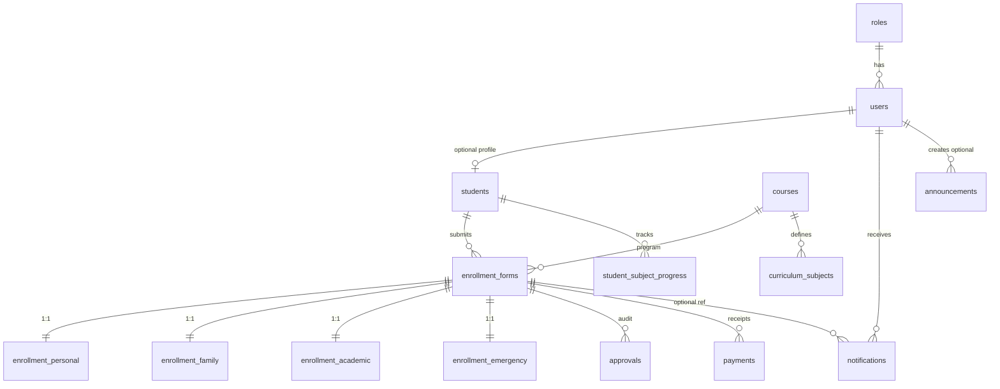

# Entity Relationship Diagram (ERD)

Core relationships (PostgreSQL, normalized):

**Status fields** on `enrollment_forms`: `phase1_status`, `phase2_status`, `phase3_status` each constrained to `Pending | Approved | Rejected`, plus `current_phase` (1–3) for UX progress.

See `database/schema.sql` for full column list, keys, and constraints.
