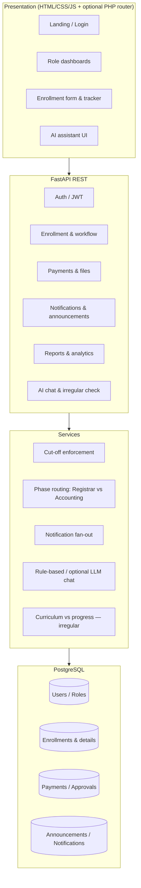

# Functional Decomposition Diagram (FDD)

The system decomposes into **presentation**, **API**, **domain services**, and **data** layers.

**Major functions**

1. **Authenticate & authorize** — JWT bearer; RBAC by role name.
2. **Capture enrollment** — Validated multi-section form; draft vs submit; cut-off gate on submit.
3. **Route phase 2** — Category “New” → Registrar; “2nd–4th Year” → Accounting (payment path).
4. **Verify payment** — File upload; Accounting approves receipt before phase 2 completion for returning students.
5. **Complete phase 3** — SAO validates ID; statuses block progression.
6. **Notify** — In-app alerts on key transitions.
7. **Report** — Admin counts by phase and status.
8. **AI** — Chatbot + step hints + irregular subject simulation.
